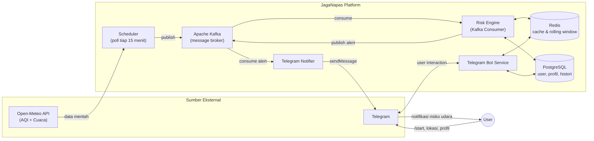

# High-Level Diagram — JagaNapas

Gambaran arsitektur tingkat tinggi: dari sumber data cuaca/AQI, diproses lewat pipeline event-driven, sampai notifikasi diterima user di Telegram.

**Ringkasan alur:**
1. Scheduler menarik data AQI & cuaca dari Open-Meteo tiap 15 menit.
2. Data mentah dipublish ke Kafka, lalu diproses Risk Engine (hitung tren via Redis, cocokkan dengan subscription di Postgres).
3. Skor risiko yang lolos threshold & debounce dikirim sebagai alert ke Telegram.
4. User berinteraksi dua arah dengan bot (daftar lokasi, atur profil sensitivitas, cek status) via Telegram Bot Service.
