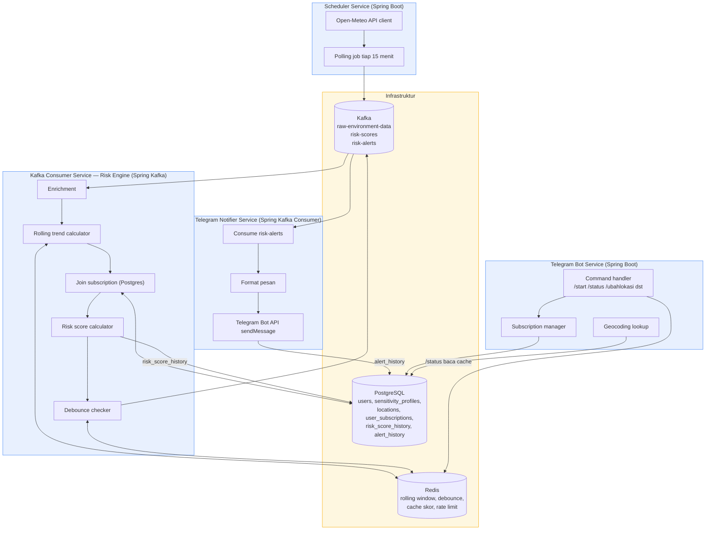

# Component Diagram — JagaNapas

Rincian komponen/service, teknologi yang dipakai, dan bagaimana mereka saling terhubung — mengikuti arsitektur di PRD bagian 6 & 7.

**Catatan komponen:**
| Service | Tanggung jawab utama | Terhubung ke |
|---|---|---|
| Scheduler Service | Polling Open-Meteo, publish data mentah | Kafka |
| Telegram Bot Service | Interaksi user, kelola subscription/profil | Postgres, Redis, Kafka (implisit via Bot API) |
| Kafka Consumer (Risk Engine) | Enrichment, trend, scoring, debounce | Kafka, Redis, Postgres |
| Telegram Notifier Service | Kirim alert ke user | Kafka, Telegram Bot API, Postgres |
