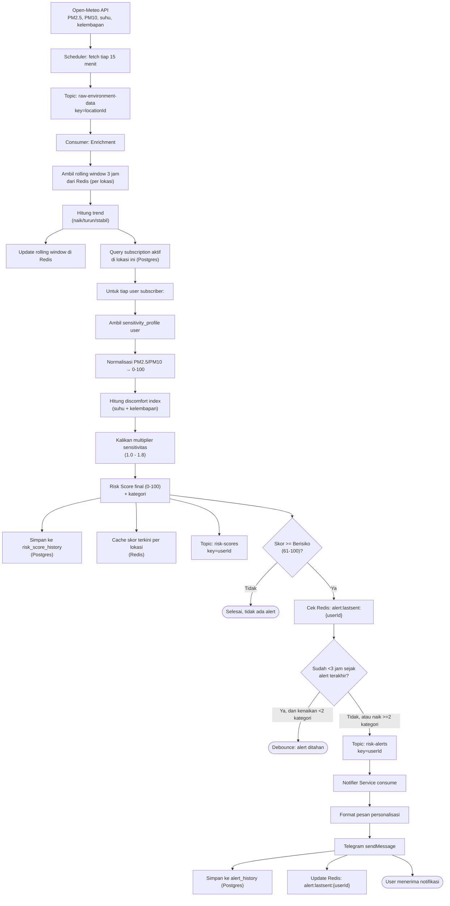

# Data Flow Diagram — JagaNapas

Menelusuri perjalanan satu data point AQI/cuaca dari sumber sampai jadi notifikasi, termasuk baca/tulis ke Redis & Postgres di tiap tahap (PRD bagian 6, 9, 10).

**Poin penting alur data:**
- Setiap event mentah bisa menghasilkan banyak `risk-scores` (satu per user subscriber di lokasi itu), tapi hanya sebagian lolos jadi `risk-alerts`.
- Redis berperan sebagai *state* jangka pendek (rolling window, debounce), Postgres sebagai *system of record* jangka panjang (histori, profil).
- Idempotency: sebelum publish ke `risk-alerts`, wajib cek debounce state di Redis agar tidak reprocessing menyebabkan pesan dobel (NFR di PRD bagian 13).
