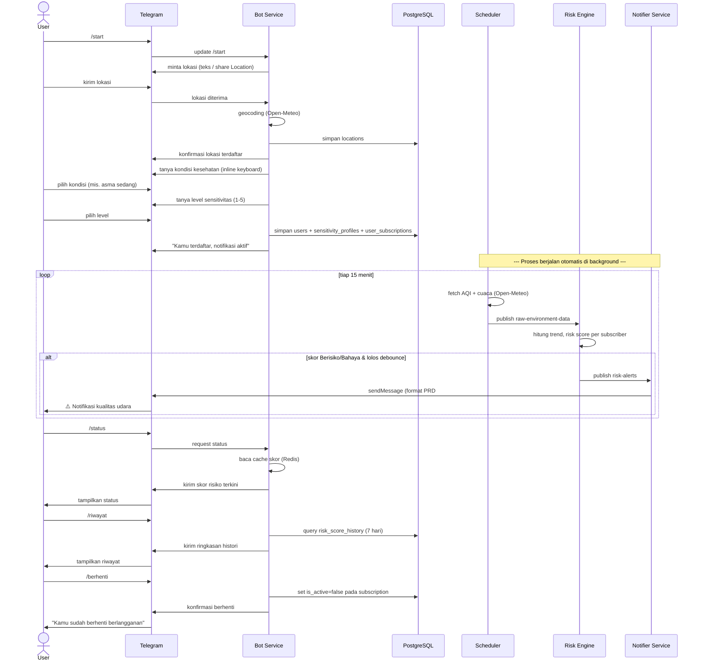

# Application Flow Diagram — JagaNapas

Sequence diagram interaksi user dengan bot Telegram, dari onboarding sampai menerima notifikasi (PRD bagian 5 & 11).

**Command yang tersedia setelah onboarding:**
`/status`, `/ubahlokasi`, `/ubahprofil`, `/berhenti`, `/riwayat` — semua dijelaskan di PRD bagian 5.
