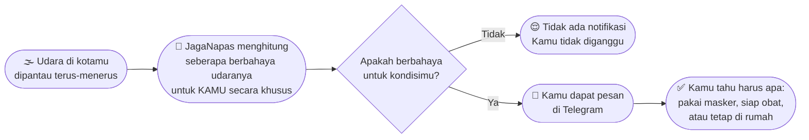
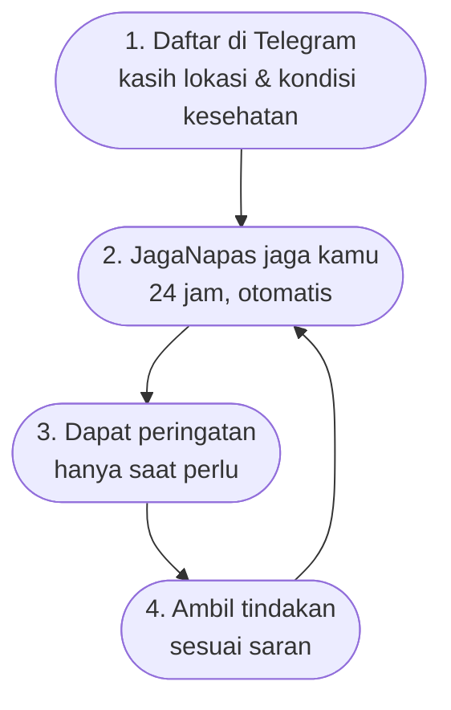

# Diagram untuk Non-IT — Bagaimana JagaNapas Bekerja

Versi sederhana, tanpa istilah teknis — untuk dijelaskan ke stakeholder, keluarga, atau siapa pun yang tidak paham arsitektur software.

## Cerita singkatnya

1. **Kamu daftar sekali** — kasih tahu bot di mana kamu tinggal, dan apakah kamu punya riwayat asma/gangguan napas.
2. **JagaNapas terus memantau** kualitas udara di lokasimu, sepanjang hari, tanpa kamu perlu buka aplikasi apapun.
3. **Kamu baru dihubungi kalau memang perlu** — bukan tiap jam, bukan spam. Hanya saat udara di sekitarmu benar-benar mulai berbahaya buat kondisi kesehatanmu.
4. **Pesannya jelas dan actionable** — bukan cuma angka teknis, tapi saran konkret: pakai masker, hindari keluar rumah, atau siapkan obat.

> Analogi: JagaNapas seperti punya teman yang selalu cek cuaca dan kualitas udara untukmu, lalu hanya menegur kamu saat benar-benar penting — dia tahu riwayat kesehatanmu jadi sarannya juga personal, bukan generik.
